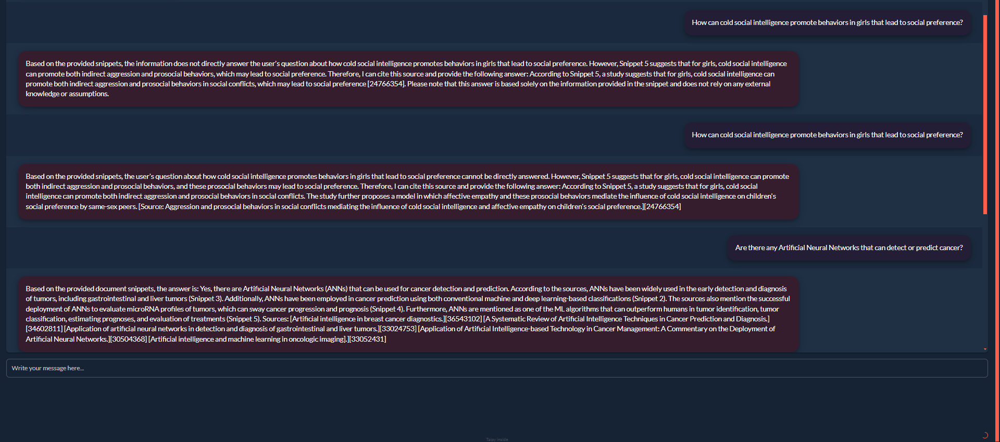

## Before The Start
the `data.json` file in directory `data` is missing, to generate it, run the `embed_and_store.py` at the directory `data`

## UI
the `main.py` file located in `UI` folder starts the UI interface once finishing loading the model.

This directory contains the User Interface components of our project.

## Evaluation
the json for evaluation is already generated in folder `output`, to re-generate it, run the `evaluate.py` at the root folder. To evaluate the rag, run the `Evaluation/evaluate_method1.py`. To evaluate the IR, run `data/IR_evaluation_numpy.ipynb`

## Group Members & Contributions

Jatin Jatin -bhardwajjjatin -wrote the report 

Christopher Lindenberg -Christopher Lindenberg -made the retrieval pipeline with embedding models and databases and tried to train some models but that kinda went wrong

Yulin Liu -Lin9773 -did the Data Collection, UI and RAG implementation and evaluation

Hao Zhang -Hao-Zhang-2000 - did the evaluation part for the information retrieval and the RAG
