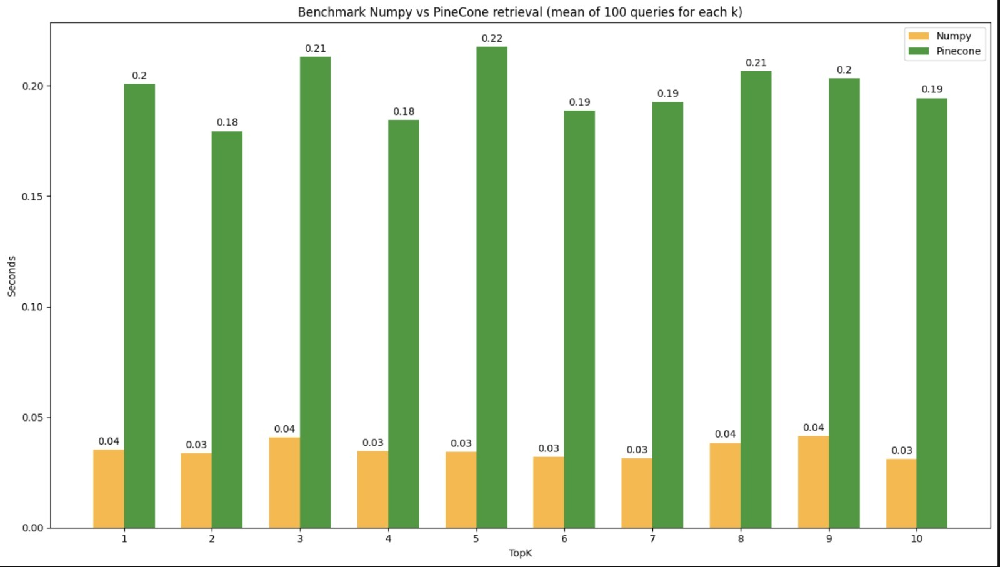

**NLP Project**

### Christopher Lindenberg 

### Jatin Jatin 

###  Hao Zhang

###  Yulin Liu 

###  Group 36 

> **Abstract**
>
> Our group project involves creating a QA system using machine learn-
> ing and NLP techniques to extract information from PubMed publica-
> tions. The goal is to simplify data navigation without requiring
> special- ized knowledge. We use modern NLP models, including
> Text-Embedding Models and Open Source LLMs, to enable semantic search
> and automated question answering on a subset of PubMed abstracts.
> Unlike traditional keyword-based searches, our system uses natural
> language queries, lever- aging semantic text embeddings for
> efficiency. The project focuses on data acquisition, preprocessing,
> and integrating retrieval-augmented gen- eration (RAG) and
> question-answering (QA) systems to provide users with an intuitive way
> to access well-sourced information in a specific area of medical
> research.

# Motivation

> Our group project focuses on simplifying access to recent medical
> information for both researchers and individuals with specific medical
> conditions. Recognizing the challenge of information overload,
> especially with vast literature sources like research articles and
> online blogs, our effort aims to automate the extraction and
> summarization of relevant content from PubMed publications. This tool
> intends to assist users in navigating through the data, emphasizing
> efficiency without overwhelming them.

1.  **Tackling Information Overload:**

    -   We understand the struggle of users sorting through extensive
        data. Our project automates the extraction and summarization of
        pertinent information from PubMed, providing a valuable tool for
        users to access reliable information.

    -   Imagine a tool that transforms intricate research into concise,
        useful chunks, allowing users to focus on well-sourced
        information.

2.  **Boosting Research Efficiency:**

    -   Our system automates essential information extraction, saving
        re- searchers significant time and resources previously spent on
        manual reviews.

    -   Beyond efficiency, our project aims to discover hidden
        connections, recognize patterns, and present new trends,
        facilitating easy cross- referencing of various studies.

3.  **Utilizing NLP:**

    -   Modern NLP models such as state of the art text embedding mod-
        els and open source LLMs like Mistral \[**?**\] are part of our
        armory. The embedding models create rich, context-aware
        embeddings from unprocessed text, while the LLMs can take on
        low-complexity text generation tasks.

    -   Incorporating modern NLP models like text embedding models and
        open-source LLMs, such as Mistral, our project simplifies
        semantic searching. Users can explore our chosen subset of
        PubMed's reposi- tory for streamlined navigation through medical
        research.

> The project gives users advanced text analysis capabilities by
> integrating cutting-edge NLP models.

# Problem Definition

> In the realm of medical research and healthcare decision-making,
> ineffective search techniques often hinder the retrieval of pertinent
> literature from databases
>
> like PubMed. Conventional keyword-based searches prove time-consuming
> and resource-intensive for researchers, medical experts, and
> individuals seeking med- ical information, as they often yield too
> many or irrelevant results. This chal- lenge underscores the urgent
> need for a semantic search engine tailored for medical document
> retrieval.

## Ideal Scenario

-   In an ideal scenario, this semantic search engine would offer
    intuitive nat- ural language querying capabilities, facilitating
    rapid and precise retrieval of relevant medical documents from
    PubMed. Users would benefit from comprehensive search results
    encompassing abstracts, author information, titles, and URLs,
    instilling confidence in the relevancy of retrieved docu-

> ments. Such a solution would empower healthcare professionals to make
> informed decisions, propel medical research forward, and ultimately
> en- hance patient outcomes.

## Costs of Inefficiency

-   Retrieving medical literature in an inefficient manner poses
    numerous costs. Medical researchers and practitioners spend
    substantial time manu- ally searching for medical information,
    diverting time from patient care or research activities. Inefficient
    access to medical literature can lead to de-

> lays in patient diagnosis, treatment, and outcomes, impacting
> healthcare quality and resource allocation.

-   Moreover, inefficiencies in accessing pertinent medical literature
    exacer- bate issues with study reproducibility, hindering
    collaboration on new ideas and knowledge dissemination. By
    addressing these costs and chal- lenges, the creation of an
    effective semantic search engine for medical pa-

> pers holds the potential to significantly enhance access to medical
> knowl- edge, improve patient care, and advance research outcomes.

# Model Architecture

## Retrieval-Augmented Generation (RAG) System

> The Retrieval-Augmented Generation (RAG) system combines the strengths
> of retrieval-based and generation-based approaches to provide accurate
> and in- formative responses to user queries. The architecture consists
> of the following components:

### Retriever Component

> The retriever component is responsible for retrieving relevant
> information from a knowledge base in response to user queries. It
> typically consists of the following modules:

-   **Preprocessing Module**: This module preprocesses the input query
    and knowledge base to extract relevant features and representations.

-   **Retrieval Module**: The retrieval module performs the actual
    search and retrieval process, identifying documents or passages that
    are most relevant to the input query.

-   **Ranking Module**: Once the relevant documents or passages are re-
    trieved, the ranking module ranks them based on their relevance
    scores, ensuring that the most relevant information is presented to
    the generator component.

### Generator Component

> The generator component is responsible for generating coherent and
> informa- tive responses based on the retrieved information. It
> typically consists of the following modules:

-   **Tokenization Module**: This module tokenizes the input query and
    re- trieved passages, converting them into a format suitable for
    input to the language model.

-   **Generation Module**: The generation module utilizes a large-scale
    lan- guage model such as GPT (Generative Pre-trained Transformer) to
    gen- erate natural language responses based on the tokenized input.

-   **Post-processing Module**: Once the response is generated, the
    post- processing module performs any necessary formatting or
    adjustments to ensure that the final output is coherent and
    readable.

### Integration

> The retriever and generator components are integrated seamlessly to
> form the complete RAG system. The retriever component retrieves
> relevant information from the knowledge base, which is then fed into
> the generator component to gen- erate the final response. This
> integration ensures that the generated responses are contextually
> relevant and factually accurate.

## Question Answering (QA) System

> The Question Answering (QA) system is designed to provide accurate
> answers to user queries based on a given context. The architecture
> consists of the following components:

### Preprocessing Module

> The preprocessing module is responsible for tokenizing the input
> context and query and preparing them for input to the QA model.

### QA Model

> The QA model is a machine learning model trained to predict the answer
> to a given question based on a provided context. It typically consists
> of a pre-trained language model fine-tuned on a QA dataset such as
> SQuAD (Stanford Question Answering Dataset).

### Post-processing Module

> The post-processing module is responsible for extracting and
> formatting the predicted answer from the output of the QA model to
> ensure readability and coherence.
>
> {width="5.070087489063867in"
> height="2.744792213473316in"}
>
> Figure 0.1: UI interface

### Integration

> The QA system integrates the preprocessing, QA model, and
> post-processing modules to provide accurate answers to user queries.
> The input context and query are tokenized and fed into the QA model,
> which predicts the answer based on the context. The post-processing
> module then extracts and formats the answer for presentation to the
> user.

# RAG Evaluation and Implementation

> In this section, we delve into the evaluation and implementation of
> the Retrieval- Augmented Generation (RAG) system. RAG evaluation
> comprises two essential components: retrieval evaluation and response
> evaluation. We will discuss each aspect in detail, including their
> implementation steps and considerations.

## Retrieval Evaluation

> Retrieval evaluation aims to assess the accuracy and relevance of the
> information retrieved by the RAG system. The following metrics are
> commonly used for retrieval evaluation:

-   **Hit Rate**: Hit rate measures the frequency with which the RAG
    system provides the correct answer within the top few guesses. It
    indicates the system's ability to retrieve relevant information
    effectively.

-   **Mean Reciprocal Rank (MRR)**: MRR calculates the average of the
    reciprocals of the ranks of correct answers across all queries. It
    provides a more nuanced understanding of retrieval performance by
    considering the order of correct answers.

> **Implementation:**
>
> To implement retrieval evaluation, we first need to define a method
> for cal- culating the Hit Rate and MRR. This typically involves
> comparing the retrieved answers with the ground truth answers for a
> set of queries.

## Response Evaluation

> Response evaluation focuses on assessing the quality and
> appropriateness of the responses generated by the RAG system based on
> the retrieved information. Two key evaluators are commonly used for
> response evaluation:

-   **Faithfulness Evaluator**: This evaluator measures whether the
    response from the RAG system matches any source context. It helps
    detect in- stances where the system generates inaccurate or
    hallucinated responses.

-   **Relevancy Evaluator**: The relevancy evaluator assesses whether
    the response, along with the source context, adequately addresses
    the query posed to the system. It ensures that the generated
    response is relevant and informative.

> **Implementation:**
>
> To implement response evaluation, we need to create evaluators for
> both faithfulness and relevancy. These evaluators typically involve
> comparing the generated responses with the ground truth answers and
> source context.

## Implementation

> Integrating the evaluation pipeline into the RAG system allows us to
> evaluate both retrieval and response aspects comprehensively. Here are
> the key steps involved in implementing the evaluation pipeline:

1.  **Data Preparation**: Prepare evaluation datasets containing
    question- answer pairs and ground truth answers for retrieval and
    response evalua- tion.

2.  **Evaluation Metrics**: Define appropriate evaluation metrics such
    as Hit Rate, MRR, and evaluators for faithfulness and relevancy.

3.  **Integration**: Integrate the evaluation pipeline into the RAG
    system to automatically evaluate its performance on new data.

4.  **Fine-tuning**: Continuously fine-tune and iterate on the
    evaluation pro- cess based on obtained results to improve system
    effectiveness.

# Data Description

## Data Source

> The dataset utilized in this project originates from the PubMed
> database, an extensive collection of biological literature.

## Data Structure

> The JSON files in the dataset are arranged according to the year of
> publication (2013 to 2023). Every JSON file includes summaries taken
> from health-related literature pertaining to the concept of
> "intelligence."

## Information About Metadata

> The following metadata are included for every abstract:

-   **Article ID**: Unique identifier for the research article.

-   **Title**: Title of the article.

-   **Authors**: List of authors who contributed to the article.

-   **URL**: PubMed URL linking to the full article.

-   **Abstract Text**: A summary of the research findings found in the
    ab- stract.

# Data Acquisition Plan

## Collection Process

> The data retrieval process involves querying the PubMed database using
> the NCBI E-utilities API. The query term used is "intelligence," and
> data is re- trieved for each year from 2013 to 2023.

## Collection Parameters

-   Database: PubMed

-   Query Term: "intelligence"

-   Collection Period: Each year from 2013 to 2023

## Data Storage

> Retrieved data is stored in JSON format, with separate files for each
> year. Each JSON file contains a list of dictionaries representing
> individual abstracts with associated metadata.

## Preprocessing

> There is no preprocessing done on a text level before embedding.

## Embedding Generation

> First we tokenize each abstract individually with the tokenizer to our
> chosen em-
>
> bedding model. The model we chose here is "all-MiniLM-L6-v2"
> (https://huggingface.co/sentence- transformers/all-MiniLM-L6-v2), a
> very light weight embedding model on the
>
> basis of Distilbert \[sanh2019distilbert\]. After tokenization, if the
> tokenized ab- stract is too long for the maximum context length of our
> model, we chunk the tokenized abstracts according to a minimum
> percentage overlap. These chunks are then embedded by our embedding
> model individually. For each chunk we then produce an object,
> containing it's embedding vector, the abstract it was chunked out of,
> and the articles associated metadata.

## Storage and Indexing

> We have two solutions available for storing and searching our
> embedding vec- tors. Both implement the interface "retrieve by query"
> and are thus dropin replacements for each other. The first is a
> Pinecone Database wrapper, which queries our Pinecone cloud storage.
> The second one is a basic Numpy storage, which implements similary
> search by implementing cosine similarity search by hand.
>
> Why two solutions? We've benchmarked the databases against each other
> and found that the Numpy Database is both consistently a lot faster
> for the scale that we are working on (about 20000 documents) and also
> a lot less cumber- some to implement, and even having fewer
> requirements. Pinecone for example doesn't allow arbitrary sizes of
> metadata, forcing us to truncate some abstracts that we uploaded.
> Pinecone on the other hand is more convenient and requires less setup
> when running our pipeline, since the user has to manually run a file
> that embeds and stores the data that the numpy database needs to
> access, this is of course already taken care of in a cloud solution.

# Conclusion

> Throughout this project, we have undertaken a comprehensive
> exploration of Retrieval-Augmented Generation (RAG) systems, as well
> as the development of Question-Answering (QA) systems, with the aim of
> enhancing natural language understanding and generation capabilities.
> Our journey encompassed various stages, from conceptualization to
> implementation, evaluation, and beyond.
>
> In the realm of RAG systems, we have investigated two critical
> aspects: re- trieval evaluation and response evaluation. Retrieval
> evaluation involved assess- ing the accuracy and relevance of
> information retrieved from knowledge bases. Metrics such as Hit Rate
> and Mean Reciprocal Rank (MRR) were utilized to quantify the
> performance of retrieval algorithms. Furthermore, we implemented
> evaluators for faithfulness and relevancy to gauge the quality and
> appropriate- ness of generated responses. This comprehensive
> evaluation framework provided insights into the strengths and
> weaknesses of our RAG system, enabling iterative improvements.

{width="6.166666666666667in"
height="3.4995833333333333in"}

Figure 1: A benchmark of our Numpy Database and our Pinecone Database.

> On the QA system front, we leveraged state-of-the-art language models
> such as GPT-3.5 and integrated them into our pipeline for generating
> responses to user queries. We fine-tuned these models and evaluated
> their performance using rigorous evaluation methodologies. Through
> this process, we aimed to develop robust QA systems capable of
> providing accurate and relevant answers to a diverse range of
> questions.
>
> Moving forward, our exploration of RAG and QA systems has unearthed
> several open issues and areas for further research and development:

1.  **Open Issues**

-   **Scalability**: Scaling RAG and QA systems to handle large-scale
    knowl- edge bases and diverse user queries remains a challenge.
    Future research should focus on developing scalable architectures
    and algorithms to sup- port efficient information retrieval and
    generation.

-   **Generalization**: Enhancing the generalization capabilities of RAG
    and QA systems to handle a wide range of domains, topics, and
    languages is crucial. Further research is needed to improve model
    robustness and adaptability across different contexts.

-   **Evaluation Methodologies**: While existing evaluation metrics
    provide valuable insights, there is a need for more nuanced and
    comprehensive evaluation methodologies for assessing the performance
    of RAG and QA systems. Future work should explore novel evaluation
    approaches to cap- ture the multifaceted nature of natural language
    understanding and gen-

> eration.

-   **Ethical Considerations**: As RAG and QA systems become more perva-
    sive, addressing ethical concerns such as bias, fairness, and
    accountability becomes increasingly important. Future research
    should prioritize ethical considerations to ensure responsible
    development and deployment of these technologies.

-   **Integration with Real-World Applications**: Bridging the gap be-
    tween research prototypes and real-world applications remains a
    challenge for RAG and QA systems. Future efforts should focus on
    integrating these technologies into practical applications such as
    virtual assistants, customer support systems, and educational
    platforms.

> **References**

1.  Distilling the knowledge in a neural network. ar5iv, 2015.
    https://ar5iv.labs.arxiv.org/abs/1503.02531

2.  DistilBERT, a distilled version of BERT: smaller, faster, cheaper
    and lighter. ar5iv, 2019.

> https://ar5iv.labs.arxiv.org/abs/1910.01108

3.  Retrieval-augmented generation for knowledge-intensive NLP tasks.
    ar5iv, 2020.

> https://ar5iv.labs.arxiv.org/abs/2005.11401

4.  Boosting Classification Reliability of NLP Transformer Models.
    ar5iv, 2022. https://ar5iv.labs.arxiv.org/html/2209.06049

5.  Preparing Legal Documents for NLP Analysis: Improving the
    Classifications of Text Elements by Using Page Features.
    ResearchGate.
    h[ttps://www.researc](http://www.researchgate.net/publication/358028171)hgate.n[et/publication/358028171](http://www.researchgate.net/publication/358028171)
